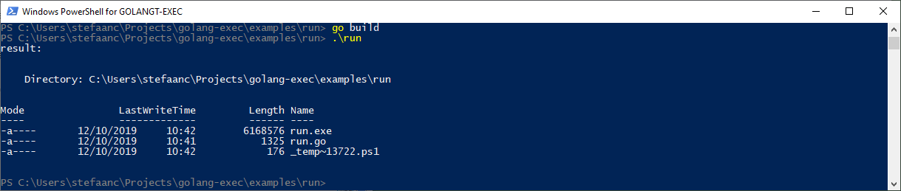
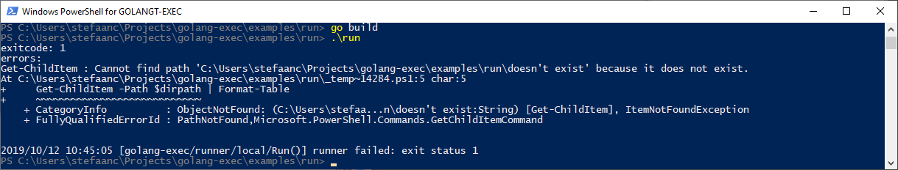
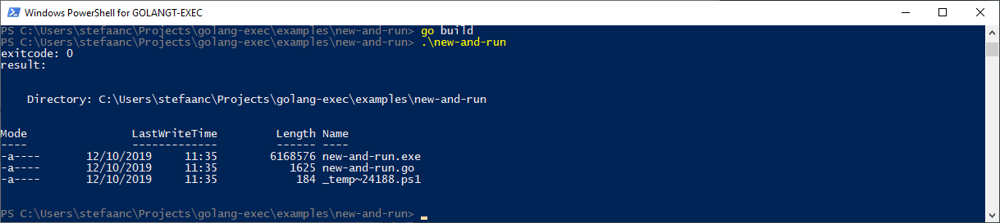
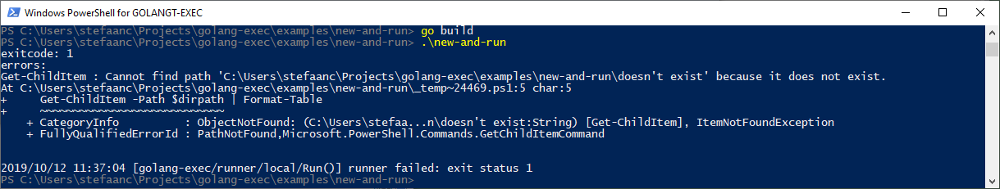
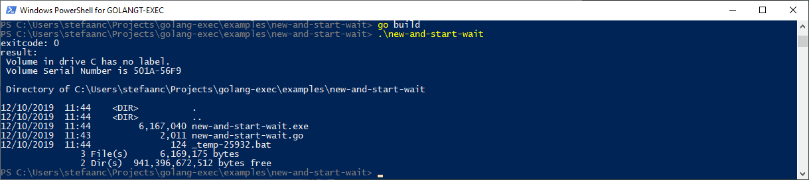
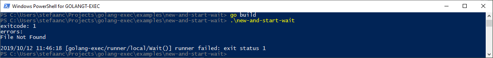

# Golang Exec

**a golang package to run scripts locally or remotely**

The main use-case for this package is to run scripts that are embedded in a golang executable, and run them locally or remotely.  An example where this is used is in the development of a terraform provider (this is the reason why we developed this).

Scripts can be defined at development-time as a string or can be read at run-time from a file.  They are parsed as a golang template.  This template is then rendered with template-arguments.  The resulting rendered code is either executed on the local machine or remotely.  A shell is started on the machine, the script is loaded via `stdin`, and is executed in the shell.  A number of shells are supported: windows cmd, powershell, bash, sh, ... The script is uploaded via `stdin` to avoid having to separately upload it before running (for instance using SCP) and to avoid having to clean up after running.  Results from the script can be received from the shell's `stdout`.  Errors can be received from the shell's `stderr`.

As an alternative to using the `Connection` types from the specific runners - "golang-exec/runner/local" or "golang-exec/runner/ssh" - you can make your own connection struct type or embed this in your own bigger struct type.  Your struct type must contain the relevant fields with the same field-names as the fields required for the specific runner.  The golang-exec package uses reflection to extract the connection information from your struct.  This is useful when the connection type needs to be configurable, so it is not known in advance which specific runner will be used.

For a `"local"` runner, you need at least the following fields

```golang
type Connection struct {
    Type string   // must be "local"
}
```

For a `"ssh"` runner, you need at least the following fields

```golang
type Connection struct {
    Type     string   // must be "ssh"
    Host     string
    Port     uint16
    User     string
    Password string
    Insecure bool
}
```

As another alternative to using the `Connection` types from the specific runners, you can also use a map: `map[string]string`.  Disadvantage of this is that fields with a non-string type are not statically type-checked.


<br/>

## Basic Use

A couple of very basic examples.

### Using runner.Run()

To test this, change the `User` and `Password` in the following code (marked).  Alternatively, you can also change the `Type` to `"local"`.  Comment/uncomment the `Path` to select the current working directory or a directory that doesn't exist.

In this example
- we use the `Connection` type from the `"ssh"` runner
- we use `runner.Run()` to execute the script
- we capture the results/errors using a stdout-writer/stderr-writer
- we capture the exitcode when the script fails

Remark that all runner errors are wrapped, so you can get extra info such as script name and exitcode via the wrapper.

```golang
package main

import (
    "bytes"
    "errors"
    "fmt"
    "log"
    "os"
    "github.com/stefaanc/golang-exec/runner"
    "github.com/stefaanc/golang-exec/runner/ssh"
    "github.com/stefaanc/golang-exec/script"
)

func main() {
    // define connection to the server
    c := ssh.Connection{
        Type: "ssh",                              // <<<<<<<<<<<<<<<<<<<<
        Host: "localhost",
        Port: 22,
        User: "me",                               // <<<<<<<<<<<<<<<<<<<<
        Password: "my-password",                  // <<<<<<<<<<<<<<<<<<<<
        Insecure: true,
    }

    // create buffers to capture stdout & stderr
    var stdout bytes.Buffer
    var stderr bytes.Buffer

    // create script runner
    wd, _ := os.Getwd()
    err := runner.Run(c, lsScript, lsArguments{
//        Path: wd + "\\doesn't exist",           // <<<<<<<<<<<<<<<<<<<<
        Path: wd,                                 // <<<<<<<<<<<<<<<<<<<<
    }, &stdout, &stderr)
    if err != nil {
        var runnerErr runner.Error
        errors.As(err, &runnerErr)
        fmt.Printf("exitcode: %d\n", runnerErr.ExitCode())

        fmt.Printf("errors: \n%s\n", stderr.String())
        log.Fatal(err)
    }

    // write the result
    fmt.Printf("result: \n%s", stdout.String())
}

type lsArguments struct{
    Path string
}

var lsScript = script.New("ls", "powershell", `
    $ErrorActionPreference = 'Stop'

    $dirpath = "{{.Path}}"
    Get-ChildItem -Path $dirpath | Format-Table

    exit 0
`)
```



> Remark that we don't get an exitcode when successful - the exitcode is expected to be 0.  You need to use one of the following examples if you want to capture the exitcode from a successfully executed script. 



> Remark that we can get to the exitcode, using the error-wrapper, when the script fails


### Using runner.New() and r.Run()

To test this, change the `User` and `Password` in the following code (marked).  Alternatively, you can also change the `Type` to `"local"`.  Comment/uncomment the `Path` to select the current working directory or a directory that doesn't exist.

In this example 
- we are using our own `Connection` type
- we use `runner.New()` to create a runner `r`, then use `r.Run()` to execute the script
- we capture the results/errors using a stdout-writer/stderr-writer
- we capture the exitcode when the script succeeds or fails

```golang
package main

import (
    "bytes"
    "fmt"
    "log"
    "os"
    "github.com/stefaanc/golang-exec/runner"
    "github.com/stefaanc/golang-exec/script"
)

type myConnection struct {
    Type     string
    Host     string
    Port     uint16
    User     string
    Password string
    Insecure bool
}

func main() {
    // define connection to the server
    c := myConnection{
        Type: "ssh",                              // <<<<<<<<<<<<<<<<<<<<
        Host: "localhost",
        Port: 22,
        User: "me",                               // <<<<<<<<<<<<<<<<<<<<
        Password: "my-password",                  // <<<<<<<<<<<<<<<<<<<<
        Insecure: true,
    }

    // create script runner
    wd, _ := os.Getwd()
    r, err := runner.New(c, lsScript, lsArguments{
//        Path: wd + "\\doesn't exist",           // <<<<<<<<<<<<<<<<<<<<
        Path: wd,                                 // <<<<<<<<<<<<<<<<<<<<
    })
    if err != nil {
        log.Fatal(err)
    }
    defer r.Close()

    // create buffer to capture stdout, set a stdout-writer
    var stdout bytes.Buffer
    r.SetStdoutWriter(&stdout)

    // create buffer to capture stderr, set a stderr-writer
    var stderr bytes.Buffer
    r.SetStderrWriter(&stderr)

    // run script runner
    err = r.Run()
    if err != nil {
        fmt.Printf("exitcode: %d\n", r.ExitCode())
        fmt.Printf("errors: \n%s\n", stderr.String())
        log.Fatal(err)
    }

    // write the result
    fmt.Printf("exitcode: %d\n", r.ExitCode())
    fmt.Printf("result: \n%s", stdout.String())
}

type lsArguments struct{
    Path string
}

var lsScript = script.New("ls", "powershell", `
    $ErrorActionPreference = 'Stop'

    $dirpath = "{{.Path}}"
    Get-ChildItem -Path $dirpath | Format-Table

    exit 0
`)
```



> Remark that we can get to the exitcode when we use a runner, when the script succeeds. 



> Remark that we can also get to the exitcode we use a runner, when the script fails


### Using runner.New() and r.Start() / r.Wait()

To test this, change the `User` and `Password` in the following code (marked).  Alternatively, you can also change the `Type` to `"local"`.  Comment/uncomment the `Path` to select the current working directory or a directory that doesn't exist.

In this example 
- we are using a map for our connection info
- we use `runner.New()` to create a runner `r`, then use `r.Start()` & `r.Wait()` to execute the script
- we use a cmd script instead of a powershell script, but you can also comment/uncomment one of the other ones.
- we capture results/errors using a stdout-reader/stderr-reader
- we capture the exitcode when the script succeeds or fails

```golang
package main

import (
    "fmt"
    "io/ioutil"
    "log"
    "os"
    "github.com/stefaanc/golang-exec/runner"
    "github.com/stefaanc/golang-exec/script"
)

func main() {
    // define connection to the server
    c := map[string]string{
        "Type": "ssh",                            // <<<<<<<<<<<<<<<<<<<<
        "Host": "localhost",
        "Port": "22",
        "User": "me",                             // <<<<<<<<<<<<<<<<<<<<
        "Password": "my-password",                // <<<<<<<<<<<<<<<<<<<<
        "Insecure": "true",
    }

    // create script runner
    wd, _ := os.Getwd()
    r, err := runner.New(c, lsScript, lsArguments{
//        Path: wd + "\\doesn't exist",           // <<<<<<<<<<<<<<<<<<<<
        Path: wd,                                 // <<<<<<<<<<<<<<<<<<<<
    })
    if err != nil {
        log.Fatal(err)
    }
    defer r.Close()

    // get a stdout-reader
    stdout, err := r.StdoutPipe()
    if err != nil {
        log.Fatal(err)
    }

    // get a stderr-reader
    stderr, err := r.StderrPipe()
    if err != nil {
        log.Fatal(err)
    }

    // start script runner
    err = r.Start()
    if err != nil {
        log.Fatal(err)
    }

    // wait for stdout-reader to complete
    result, err := ioutil.ReadAll(stdout)
    if err != nil {
        log.Fatal(err)
    }

    // wait for stderr-reader to complete
    errors, err := ioutil.ReadAll(stderr)
    if err != nil {
        log.Fatal(err)
    }

    // wait for script runner to complete
    err = r.Wait()
    if err != nil {
        fmt.Printf("exitcode: %d\n", r.ExitCode())
        fmt.Printf("errors: \n%s\n", string(errors))
        log.Fatal(err)
    }

    // write the result
    fmt.Printf("exitcode: %d\n", r.ExitCode())
    fmt.Printf("result: \n%s", string(result))
}

type lsArguments struct{
    Path string
}

var lsScript = script.New("ls", "cmd", `
    @echo off
    set "dirpath={{.Path}}"
    dir %dirpath%
`)

\\ var lsScript = script.New("ls", "powershell", `
\\     $ErrorActionPreference = 'Stop'
\\ 
\\     $dirpath = "{{.Path}}"
\\     Get-ChildItem -Path $dirpath | Format-Table
\\
\\     exit 0
\\ `)
```






<br/>

## More Info

A brief overview of the most important elements of this package, to give an idea what the main user-structs, -funcs and -methods are, to show the main external dependencies, and to give an idea how this package is build and hangs together.

```golang
// script/script.go
package script

import (
    "text/template"
    //...
)

type Script struct {
    Name       string
    Shell      string   // "cmd", powershell", "bash", "sh", ...
    Error      error    // error from New()
 
    template   *template.Template
    //...
}

func New(name string, shell string, code string) *Script { /*...*/ }
    // remark that New() doesn't return any errors directly
    // instead, error are saved in the 'Error'-field of the returned script
    // this allows using New() in a package scope, while checking for errors in a function scope

func NewFromString(name string, shell string, code string) (*Script, error) { /*...*/ }

func NewFromFile(name string, shell string, file string) (*Script, error) { /*...*/ }

func (s *Script) Command() string {
    // returns the command(s) to execute a script that is read from stdin
    switch s.Shell {
    case "cmd":
        // for cmd, we cannot execute code directly from stdin
        // hence we save stdin (the rendered code) to a file and then execute that file
        //
        // the steps in the command are:
        // - run a cmd command, enable delayed expansion
        // - set the name of a temp file
        // - use "more" to save stdin to temp-file
        // - use "cmd" to execute temp-file
        // - save "%errorlevel%" because it will be overwritten by the next step
        // - delete temp-file
        // - exit with saved "%errorlevel%"
        wd, _ := os.Getwd()
        return fmt.Sprintf("cmd /E:ON /V:ON /C \"set \"T=%s\\_temp-%%RANDOM%%.bat\" && more > !T! && cmd /C \"!T!\" & set \"E=!errorlevel!\" & del /Q !T! & exit !E!\"", wd)
    case "powershell":
        // for powershell, we can  execute code directly from stdin, returning "PowerShell -NoProfile -ExecutionPolicy ByPass -Command -"
        // however, it seems that fatal exceptions don't stop the script, and thus "$ErrorActionPreference = 'Stop'" also doesn't work properly
        // hence we save stdin (the rendered code) to a file using cmd and then execute that file using powershell
        //
        // the steps in the command are similar to the steps for the cmd shell
        wd, _ := os.Getwd()
        return fmt.Sprintf("cmd /E:ON /V:ON /C \"set \"T=%s\\_temp~%%RANDOM%%.ps1\" && more > !T! && PowerShell -NoProfile -ExecutionPolicy ByPass -Command \"!T!\" & set \"E=!errorlevel!\" & del /Q !T! & exit !E!\"", wd)
    default:
        // for bash,... we execute code directly from stdin
        return s.Shell + " -"
    }
}
```

```
// runner/runner.go
package runner

import (
    "io"
    "github.com/stefaanc/golang-exec/script"
    "github.com/stefaanc/golang-exec/runner/local"
    "github.com/stefaanc/golang-exec/runner/ssh"
    //...
)

type Error interface {
    Script() *script.Script
    ExitCode() int   // -1 when runner error without completing script
    Error() string
    Unwrap() error
}

type Runner interface {
    SetStdoutWriter(io.Writer)
    SetStderrWriter(io.Writer)

    StdoutPipe() (io.Reader, error)   // don't use in combination with Run()
    StderrPipe() (io.Reader, error)   // don't use in combination with Run()

    Run() error
    Start() error
    Wait() error
    Close() error

    ExitCode() int   // -1 when runner error without completing script
}

func Run(connection interface {}, s *script.Script, arguments interface{}, stdout, stderr io.Writer) error { /*...*/ }

func New(connection interface {}, s *script.Script, arguments interface{}) (Runner, error) { /*...*/ }
```

For a local runner

```golang
// runner/local/runner.go
package local

import (
    "context"
    "os/exec"
    "github.com/stefaanc/golang-exec/script"
    //...
)

type Connection struct {
    Type string   // must be "local"
}

type Error struct {
    script   *script.Script
    exitCode int
    err      error
    // ...
}

type Runner struct {
    cmd      *exec.Cmd
    cancel   context.CancelFunc
    exitCode int
    //...
}
```

For a SSH runner

```golang
// runner/ssh/runner.go
package ssh

import (
    "golang.org/x/crypto/ssh/knownhosts"
    "golang.org/x/crypto/ssh"
    "github.com/stefaanc/golang-exec/script"
    //...
)

type Connection struct {
    Type     string   // must be "ssh"
    Host     string
    Port     uint16
    User     string
    Password string
    Insecure bool
}

type Error struct {
    script   *script.Script
    exitCode int
    err      error
    // ...
}

type Runner struct {
    client  *ssh.Client
    session *ssh.Session
    exitCode int
    //...
}
```


<br/>

## For Further Investigation

- support for setting environment variables
- support for SSH auth using certificates instead of password
- support for Pageant on Windows
- support for SSH bastion server
- support for WinRM communication